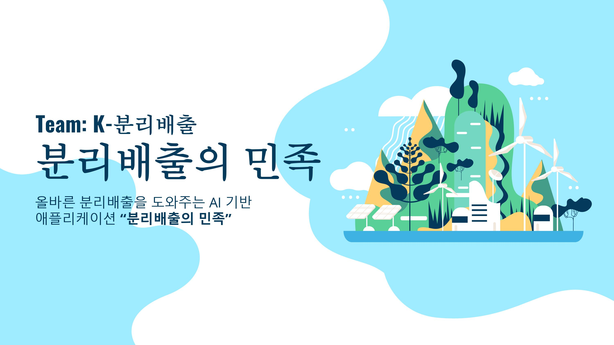
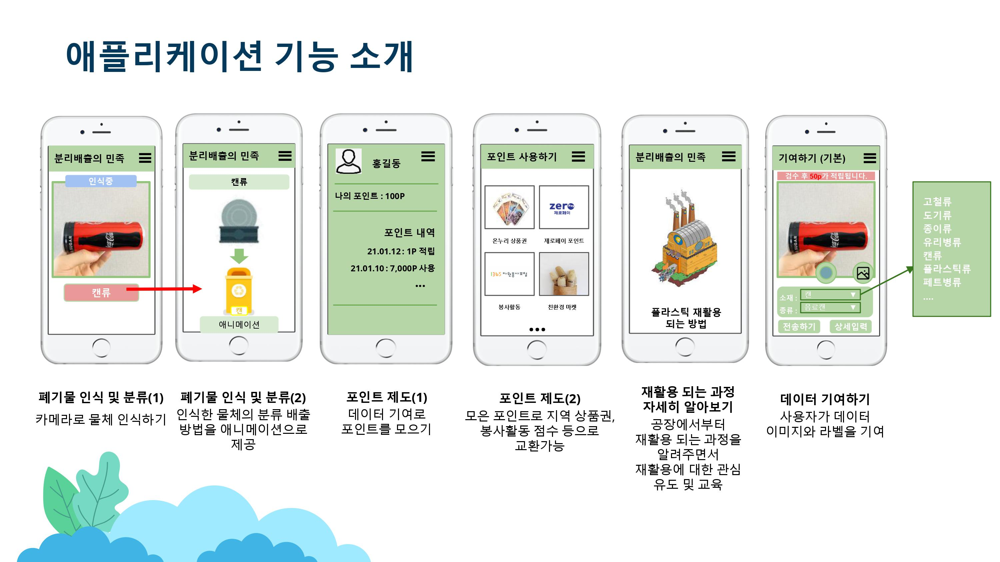
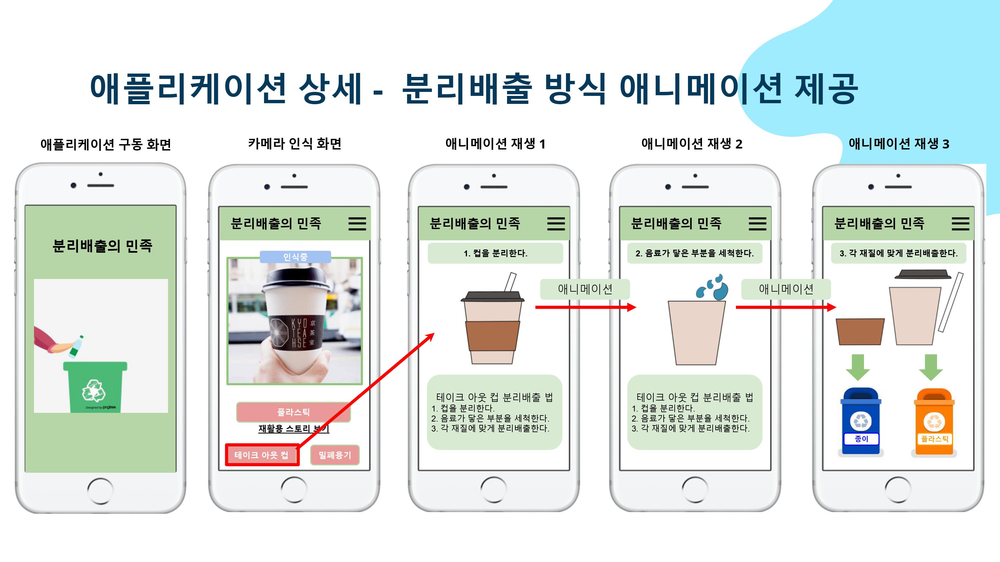
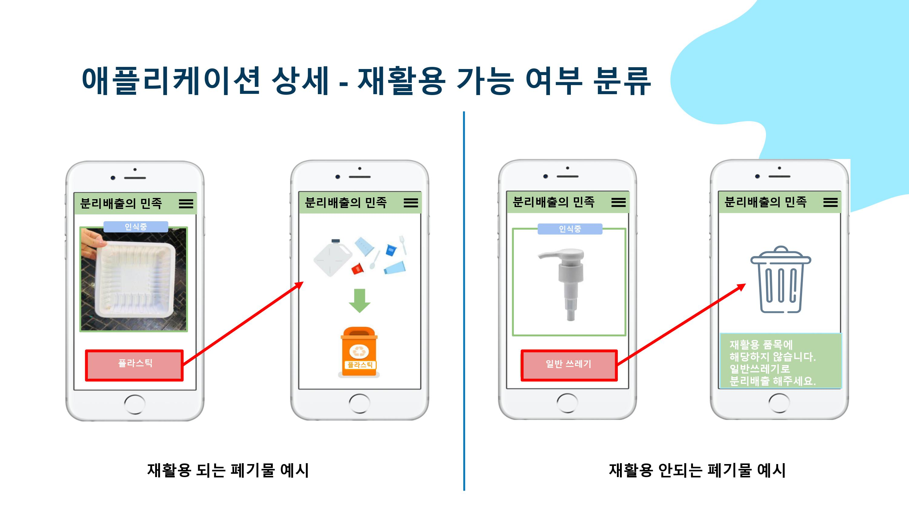

# 분리배출의 민족

팀페이지 주소 : https://kookmin-sw.github.io/capstone-2021-3/


## 1. 프로젝트 소개



이 프로젝트는 Image Classification을 이용하여 사용자에게 버리는 물품을 인식하여 어떻게 분리배출을 하는지 알려주어 올바른 분리배출을 할 수 있도록 도와주는 애플리케이션입니다.
이로 하여금 올바른 분리배출 방법을 인식하고 실천할 수 있도록 분리배출 문화를 조성합니다.


## 2. 소개

### 애플리케이션 기능 소개







## 3. 팀 소개
```

허태정

Student ID : 20181708
E-Mail : gjdigj145@kookmin.ac.kr
Role : 팀장, 
Github : [@Aqudi](https://github.com/Aqudi)

```

```

동설아

Student ID : 20171618
E-Mail : dsawt98@kookmin.ac.kr
Role : 
Github : [@gychoics](https://github.com/gychoics)

```

```

박정섭

Student ID : 20181616
E-Mail : parkjeongseop@kookmin.ac.kr
Role : 
Github : [@ParkJeongseop](https://github.com/ParkJeongseop)

```


```

허민호

Student ID : 20143115
E-Mail : gjalsgh1234@kookmin.ac.kr
Role : 
Github : [@minoring](https://github.com/minoring)

```


## 4. 사용법

#### **Python 환경 설정**
- Python 3.7 Virtual Environments 설정
- 프로젝트 루트에서 `pip install -r requirements.txt` 실행

#### **데이터 준비**
- `cd deep_learning/recycle_dataset` 실행
- `tfds build` 실행
- `python recycle_dataset_test.py` 실행으로 데이터 테스트
- "data_example.ipynb" 으로 데이터 사용예제 확인

## 5. 기타

추가적인 내용은 자유롭게 작성하세요.

